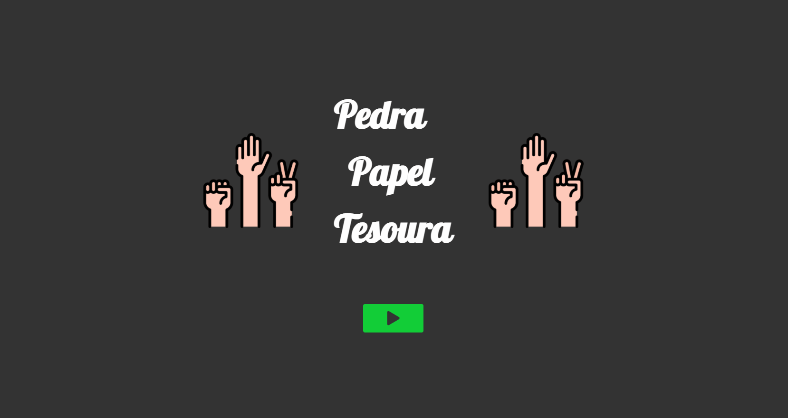

# Rock-Paper-Scissors

Um simples jogo de pedra, papel e tesoura, com React e Styled Components, com uma elegante página inicial, animação no momento da jogada, mensagem customizada para cada resultado, além de um placar, e opção de voltar para página inicial ou recomeçar o jogo. Acesse o projeto [aqui](https://react-rock-paper-scissors-dusky.vercel.app/).

Versão em [JS puro e SASS](https://github.com/theandersonfonseca/Rock-Paper-Scissors).

As imagens utilizadas foram feitos por [Icons8](https://icons8.com/) e [Freepik](https://www.freepik.com).

